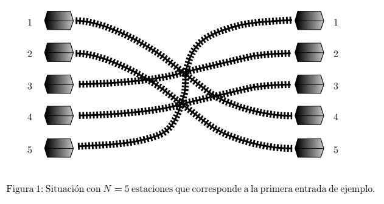

## Problema H – Hora Pico
### Autor: Nicolas ́Álvarez - Universidad Nacional del Sur

Nlogonia es una ciudad muy organizada, en la que las viviendas de sus habitantes están
todas ubicadas en el extremo Este de la ciudad y sus lugares de trabajo están ubicados
en el extremo Oeste.

En cada jornada laboral, los habitantes se dirigen a sus lugares de trabajo en el Oeste
y al terminar el día retornan a sus hogares en el Este. Para transportarse dependen del
sistema ferroviario de Nlogonia.

La compañía de trenes ofrece N servicios distintos. Cada uno de ellos hace un recorrido
que une una estación en el Oeste con una estación en el Este. Existen exactamente N
estaciones en el Oeste y N estaciones en el Este. En ambos extremos las estaciones están
numeradas de 1 a N siguiendo el orden Norte-Sur. La estación más al Norte se identifica
con el número 1 y la más al Sur con el número N. Cada estación de ambos extremos
pertenece exactamente a un servicio.

Cuando finaliza la jornada laboral, los Nlogoninos salen de sus lugares de trabajo, ansiosos
por volver a sus casas. Esto da lugar a un intenso tráfico en el sistema ferroviario conocido
como “tráfico de hora pico”.

Como se puede apreciar en la figura anterior, algunos servicios de tren se cruzan en sus
recorridos. Los recorridos de dos servicios de tren se cruzan si y sólo si el orden relativo
de los trenes en la dirección Norte-Sur es distinto al salir de la estación del Oeste que al
llegar a la estación del Este.

Para evitar accidentes, la compañía de trenes de Nlogonia decidió planificar la salida de
los trenes en turnos de manera que en cada turno no salgan dos trenes cuyos recorridos
se crucen. Para que esto no genere demoras, desean planificar los turnos de modo tal
que la cantidad total de turnos sea la mínima posible. Por suerte, en la hora pico sale
exactamente un tren de cada servicio.

Siguiendo con el ejemplo de la figura, el servicio que parte de la estación 5 se cruza con
todos los restantes y por lo tanto deberá planificarse un turno exclusivamente para su
salida. Los otros cuatro servicios no pueden salir en un único turno ya que existen cruces
entre ellos. Sin embargo, es posible agruparlos en dos turnos, uno para los trenes que
salen de las estaciones 1 y 2, y otro para los trenes que salen de las estaciones 3 y 4. De
este modo, hace falta planificar un total de 3 turnos para evitar todo riesgo de colisiones.

Ustedes serán los encargados de esta tarea: dadas las descripciones de los N servicios de
tren de Nlogonia, deben determinar cuál es la mínima cantidad de turnos en los que se
pueden planificar las salidas en la hora pico evitando todo riesgo de accidentes.

#### Entrada
La primera línea contiene un entero N indicando la cantidad de servicios de tren en
Nlogonia (1 ≤ N ≤ 105). La segunda línea contiene N enteros distintos E1, E2, . . . , EN
(1 ≤ Ei ≤ N), indicando que el tren que sale de la estación i en el Oeste debe llegar a la
estación Ei en el Este, para i = 1, 2, . . . , N.
#### Salida
Imprimir en la salida una línea conteniendo un único entero que representa la cantidad
mínima de turnos en la que se pueden planificar los servicios.

| Entrada de Ejemplo     | Salida para la entrada de ejemplo        |
| -----------------------|------------------------------------------|
| 5                      | 3                                        |
| 4 5 2 3 1              |                                          |

| Entrada de Ejemplo     | Salida para la entrada de ejemplo        |
| -----------------------|------------------------------------------|
| 3                      | 1                                        |
| 1 2 3                  |                                          |

| Entrada de Ejemplo     | Salida para la entrada de ejemplo        |
| -----------------------|------------------------------------------|
| 9                      | 4                                        |
| 9 4 2 7 8 3 5 6 1      |                                          |

