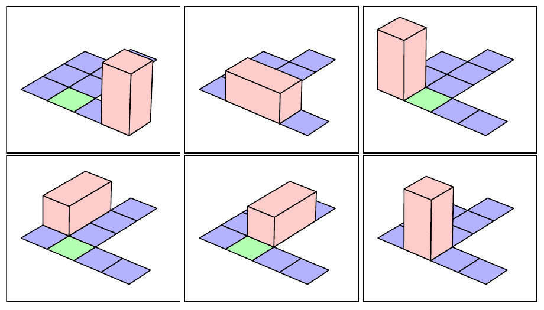

## Problema A – A guardar
### Autor: Matı́as Hunicken - Universidad Nacional de Córdoba

Benito es un niño muy consentido. Tiene una gran colección de juguetes cuidadosamente
acomodados en una caja con forma de prisma rectangular de dimensiones 2 × 1 × 1
guardada en el sótano. Todas las tardes su madre mueve la caja desde el sótano hasta la
habitación de Benito, y una vez que termina de jugar guarda los juguetes de nuevo en la
caja y la regresa al sótano.
Cansada de esta rutina, y de la nula cooperación de su hijo, ha decidido asignarle la tarea
de regresar la caja al sótano. Luego de intensos berrinches que no vienen al caso, Benito
finalmente accede a obedecer dicha orden.
La caja está inicialmente “parada”, es decir: con una de las caras de dimensiones 1 × 1
apoyada sobre el suelo. El objetivo de Benito es que la caja quede “parada”, pero en la
posición de entrada al sótano.
Benito no tiene suficiente fuerza para llevar la caja alzándola, y no quiere arrastrarla para
que no se desgaste. Por lo tanto, la única forma que tiene de mover la caja es haciéndola
rotar sobre alguna de las aristas de la cara de abajo de la misma, hasta apoyar otra cara
sobre el suelo.
La casa se puede describir como una grilla N × M , donde algunas posiciones están ocu-
padas (o sea, la caja no puede ser apoyada sobre las mismas), y hay dos posiciones (no
ocupadas) especiales: la entrada al sótano y la posición inicial de la caja.
Benito quiere realizar la menor cantidad de movimientos para llevar la caja al sótano,
¿pueden ayudarlo?

#### Entrada
La primera lı́nea contiene dos enteros N y M , la cantidad de filas y columnas de la grilla
que representa la casa (1 ≤ N, M ≤ 1000). Las siguientes N lı́neas contienen una cadena
de M caracteres cada una y representan la descripción de la casa. Los caracteres que
pueden estar presentes en cada cadena son:
C , que representa la posición inicial de la caja.
E , que representa la posición de la entrada al sótano.
\# , que representa una posición ocupada.
. , que representa una posición libre que no es la posición inicial de la caja ni la
entrada al sótano.
Se garantiza que los caracteres C y E aparecen exactamente una vez en la grilla.
#### Salida
Imprimir en la salida una lı́nea conteniendo un entero d que representa la menor cantidad
de movimientos necesarios para mover la caja de su posición inicial al sótano. Si es
imposible mover la caja al sótano, imprimir en su lugar el valor −1.
En caso de que sea posible mover la caja al sótano, imprimir en la segunda lı́nea una
cadena de d caracteres, que representa los movimientos que se deben realizar en una
secuencia óptima. Cada carácter debe ser uno de U, D, L o R, que representan que en ese
paso la caja se debe empujar hacia arriba, abajo, izquierda o derecha (según la grilla),
respectivamente.
Para los casos de prueba, se garantiza que cuando se puede llegar, la secuencia óptima es
única.
